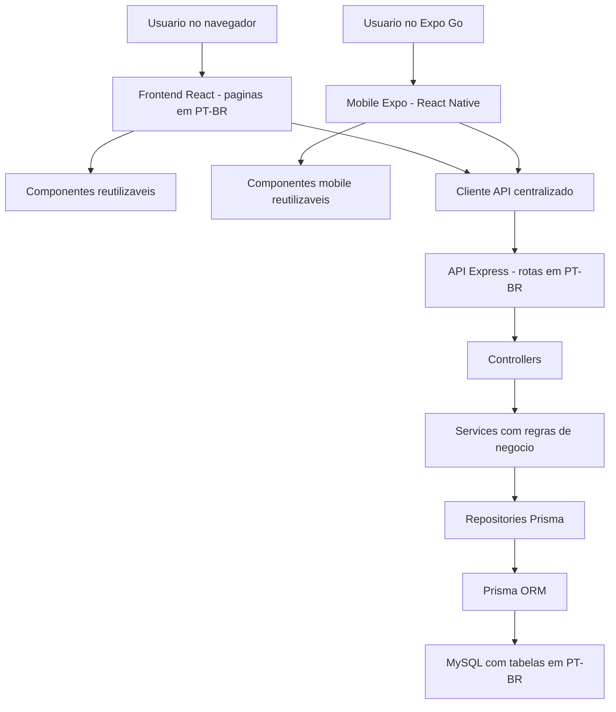

# Arquitetura e Evidencias Tecnicas - Shape

## Objetivo

Este documento mostra como a arquitetura do Shape atende a rubrica de Arquitetura de Software: padronizacao, componentizacao, clean code, CRUD integrado, regras de negocio e validacoes.

## Visao em Camadas

## Padrao de Pastas

| Area | Caminho | Finalidade |
| --- | --- | --- |
| Frontend | `frontend/src/pages` | Paginas visiveis do sistema |
| Componentes | `frontend/src/components` | Elementos reutilizaveis de layout e UI |
| Mobile | `mobile/src/screens` | Telas React Native executadas pelo Expo Go |
| Componentes mobile | `mobile/src/components` | Botao, campo de texto e cards reutilizaveis do app Expo |
| Contexto | `frontend/src/context` | Estado global de autenticacao |
| Cliente API | `frontend/src/lib/api.ts` | Comunicacao HTTP padronizada |
| Cliente API mobile | `mobile/src/lib/api.ts` | Comunicacao HTTP do Expo com tratamento padronizado de erros |
| Backend | `backend/src` | API, regras e persistencia |
| Controllers | `backend/src/controllers` | Entrada HTTP e validacao inicial |
| Services | `backend/src/services` | Regras de negocio |
| Repositories | `backend/src/repositories` | Acesso ao banco |
| Banco | `backend/prisma` | Schema, migrations e seed |
| Tipos comuns | `shared/src` | Contratos usados por frontend e backend |

## Rotas Visiveis em PT-BR

| Area | Rota |
| --- | --- |
| Entrar | `/entrar` |
| Cadastro | `/cadastro` |
| Recuperar senha | `/recuperar-senha` |
| Redefinir senha | `/redefinir-senha` |
| Painel | `/painel` |
| Perfil | `/perfil` |
| Planos | `/planos` |
| Alunos | `/alunos` |
| Treinos | `/treinos` |
| Imagens | `/imagens` |

## Endpoints da API em PT-BR

| Funcionalidade | Endpoint |
| --- | --- |
| Cadastro | `POST /api/autenticacao/cadastro` |
| Entrar | `POST /api/autenticacao/entrar` |
| Esqueci senha | `POST /api/autenticacao/esqueci-senha` |
| Redefinir senha | `POST /api/autenticacao/redefinir-senha` |
| Usuario atual | `GET /api/usuarios/me` |
| Planos | `/api/planos` |
| Alunos | `/api/alunos` |
| Treinos | `/api/treinos` |
| Indicadores | `GET /api/painel/indicadores` |
| Imagens | `POST /api/imagens` |
| Arquivos publicos | `/uploads/imagens/:arquivo` |

## CRUD Integrado Demonstravel

O projeto possui tres CRUDs principais integrados:

- Planos: tela, validacao, API, service, repository e tabela `planos`;
- Alunos: tela, validacao, API, service, repository e tabela `alunos`;
- Treinos: tela, validacao, API, service, repository e tabela `treinos`.

Para a rubrica, basta um CRUD completo, mas o Shape entrega mais de um fluxo demonstravel.

## Boas Praticas Presentes

- TypeScript no frontend, backend e shared;
- aplicativo mobile em Expo/React Native para validacao no Expo Go;
- validacoes de CPF, e-mail e senha forte centralizadas em `shared`;
- Zod para validacao de entrada;
- React Hook Form para formularios;
- TanStack Query para cache e sincronizacao de dados;
- Controllers separados de services;
- Repositories isolando Prisma;
- Tratamento padronizado de erros;
- JWT para autenticacao;
- bcrypt para hash de senha;
- migrations versionadas;
- seed para demonstracao;
- testes unitarios e E2E;
- upload multipart com Multer;
- validacao de extensao, MIME type, assinatura real e tamanho maximo para imagens;
- geracao de nome unico para evitar colisao de arquivos;
- helper HTTP reutilizado para parametros de rota no backend.

## Decisao de Nomenclatura

O dominio do produto foi traduzido para PT-BR nas partes visiveis para apresentacao:

- tabelas fisicas do banco;
- rotas do frontend;
- endpoints da API;
- paginas principais;
- documentacao;
- comentarios explicativos.

Alguns nomes tecnicos permanecem em ingles quando fazem parte do ecossistema ou evitam risco desnecessario:

- `frontend`, `backend`, `shared`;
- nomes de bibliotecas e comandos npm;
- alguns tipos e modelos internos usados por TypeScript/Prisma.

Essa decisao evita quebrar o sistema e mostra criterio tecnico, nao descuido.
