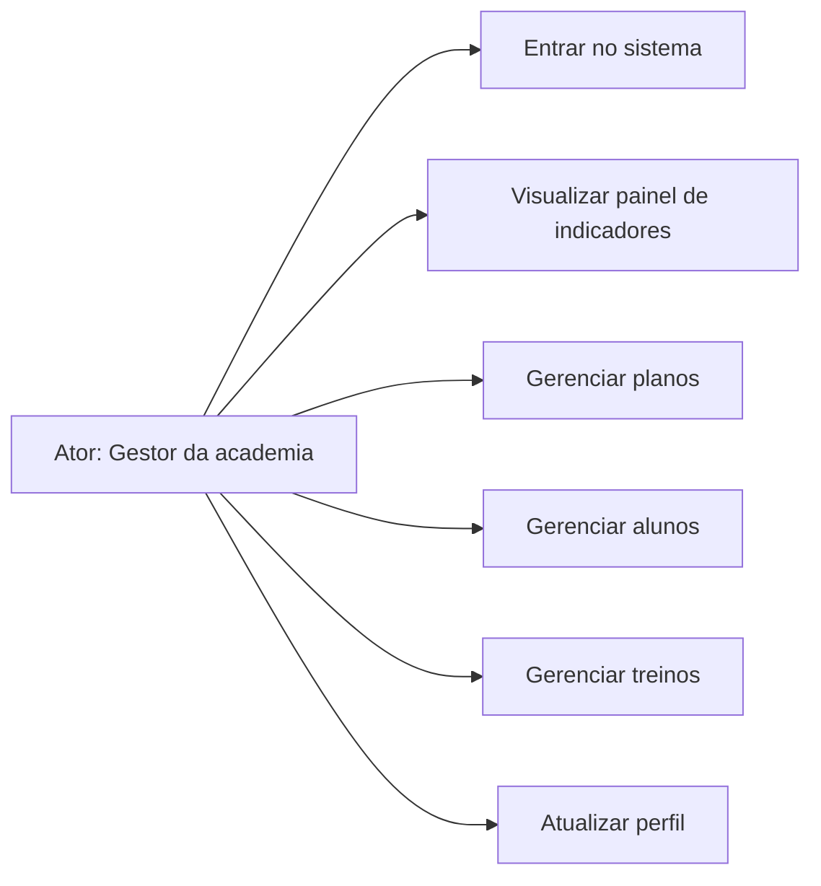
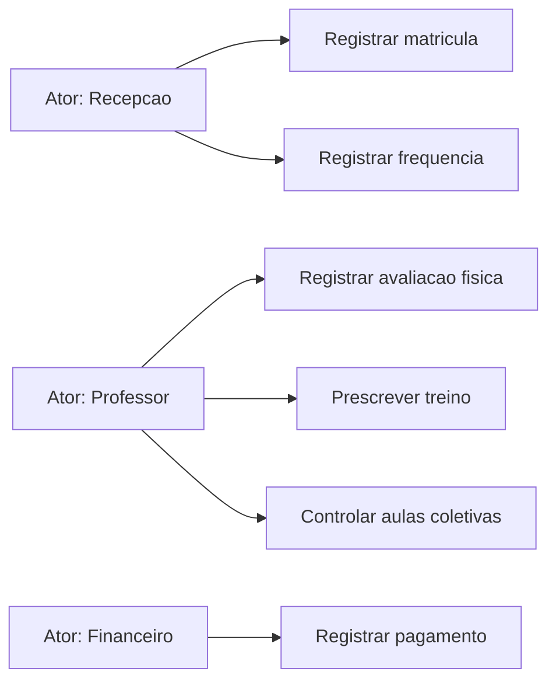
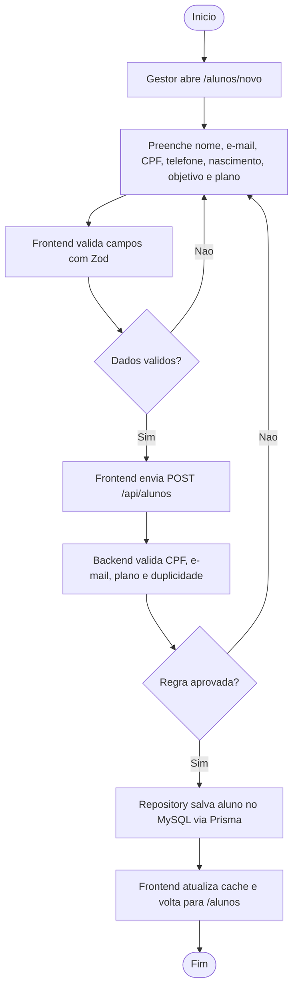
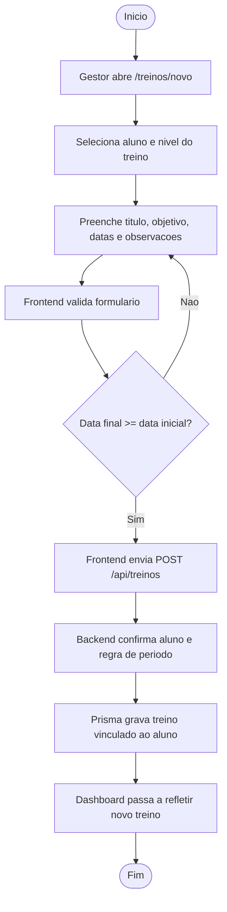
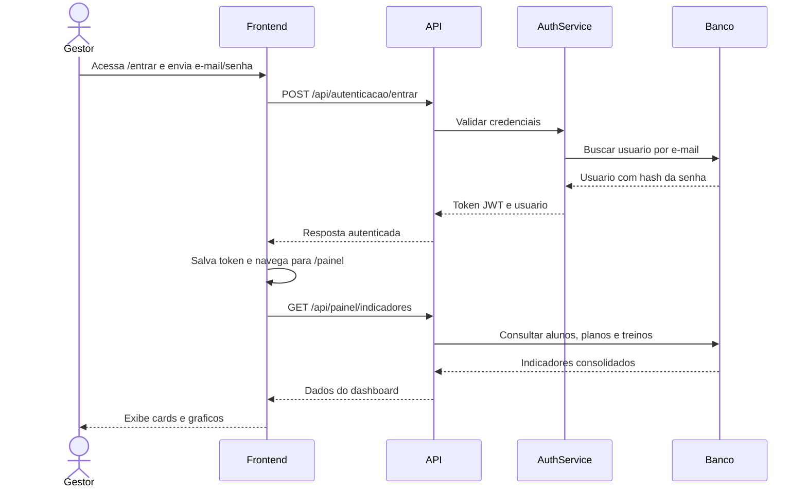
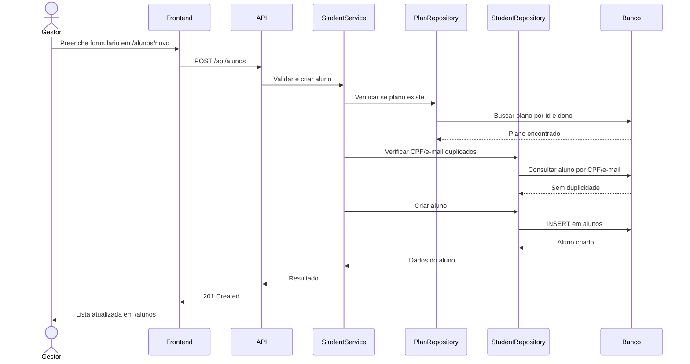

# Diagramas UML da Rubrica - Shape

## Objetivo

Este documento reune os diagramas exigidos pela rubrica: 2 casos de uso, 2 atividades e 2 sequencias. Todos representam funcionalidades reais do Shape e podem ser usados diretamente na apresentacao.

## Caso de Uso 1 - Gestao Principal da Academia

Leitura para apresentacao:
O gestor e o ator principal do MVP. Ele acessa a plataforma, acompanha indicadores e executa os CRUDs principais integrados com API e banco.

## Caso de Uso 2 - Operacao Completa da Academia

Leitura para apresentacao:
Mesmo que nem todos os modulos estejam na interface final do MVP, eles aparecem na modelagem com 27 tabelas e sustentam a evolucao do produto para uma academia completa.

## Atividade 1 - Cadastro de Aluno Com Plano

## Atividade 2 - Criacao de Treino Para Aluno

## Sequencia 1 - Entrar e Visualizar Painel

## Sequencia 2 - Cadastro de Aluno Com Vinculo a Plano

