# Modelagem de Dados e DER - Shape

## Objetivo

Este documento apresenta a proposta inicial de modelagem de dados do Shape. A modelagem foi pensada para atender a rubrica do 4o periodo, especialmente o requisito de Diagrama Entidade-Relacionamento com minimo de 20 tabelas, mantendo coerencia com o dominio de uma academia completa.

## Estrategia de Modelagem

A base antiga do SHAPEUP possuia 5 modelos principais:

- Usuario;
- Plano;
- Aluno;
- Treino;
- TokenRecuperacaoSenha.

Para a nova versao Shape, a modelagem sera ampliada para representar uma academia completa, incluindo:

- controle de academia;
- usuarios e permissoes;
- alunos;
- funcionarios e professores;
- planos;
- matriculas;
- pagamentos;
- treinos;
- exercicios;
- avaliacoes fisicas;
- frequencia;
- aulas coletivas;
- equipamentos;
- manutencoes;
- notificacoes;
- auditoria.

## Tabelas Propostas

A proposta inicial possui 27 tabelas.

Decisao de nomenclatura:
As tabelas fisicas do banco e os models do Prisma usam nomes em PT-BR. Essa decisao deixa o schema mais coerente com o dominio da academia e facilita a leitura do projeto no VS Code e no DBeaver.

| Numero | Tabela | Modulo | Prioridade | Finalidade |
| --- | --- | --- | --- | --- |
| 1 | academias | Gestao da Academia | MVP | Representa a academia que utiliza o sistema. |
| 2 | usuarios | Usuarios | MVP | Armazena usuarios que acessam o sistema. |
| 3 | perfis | Usuarios | P1 | Define perfis de acesso, como admin, professor e recepcao. |
| 4 | usuario_perfis | Usuarios | P1 | Relaciona usuarios com seus perfis. |
| 5 | tokens_recuperacao_senha | Usuarios | MVP | Controla tokens de recuperacao de senha. |
| 6 | funcionarios | Equipe | P1 | Armazena professores e funcionarios da academia. |
| 7 | alunos | Alunos | MVP | Armazena alunos da academia. |
| 8 | planos | Planos | MVP | Representa planos vendidos pela academia. |
| 9 | matriculas | Matriculas | MVP | Vincula alunos a planos contratados. |
| 10 | formas_pagamento | Financeiro | P1 | Armazena formas de pagamento aceitas. |
| 11 | pagamentos | Financeiro | MVP | Registra pagamentos de matriculas. |
| 12 | treinos | Treinos | MVP | Armazena treinos dos alunos. |
| 13 | exercicios | Exercicios | P1 | Catalogo de exercicios da academia. |
| 14 | grupos_musculares | Exercicios | P1 | Catalogo de grupos musculares. |
| 15 | exercicio_grupos_musculares | Exercicios | P1 | Relaciona exercicios e grupos musculares. |
| 16 | treino_exercicios | Treinos | P1 | Define exercicios dentro de cada treino. |
| 17 | avaliacoes_fisicas | Avaliacoes | P1 | Registra avaliacoes fisicas dos alunos. |
| 18 | medidas_corporais | Avaliacoes | P1 | Registra medidas corporais de cada avaliacao. |
| 19 | registros_frequencia | Frequencia | P1 | Registra presenca dos alunos. |
| 20 | tipos_aula | Aulas | P1 | Define tipos de aulas coletivas, como spinning ou funcional. |
| 21 | horarios_aula | Aulas | P1 | Registra horarios/turmas de aulas coletivas. |
| 22 | inscricoes_aula | Aulas | P1 | Registra inscricoes de alunos em aulas. |
| 23 | equipamentos | Equipamentos | P1 | Armazena equipamentos da academia. |
| 24 | manutencoes_equipamentos | Equipamentos | P1 | Registra manutencoes dos equipamentos. |
| 25 | metas | Alunos | P2 | Registra metas de alunos. |
| 26 | notificacoes | Comunicacao | P2 | Registra notificacoes internas. |
| 27 | logs_auditoria | Auditoria | P2 | Registra eventos relevantes para rastreabilidade. |

## Tabelas Prioritarias Para o MVP

Para a primeira entrega funcional, as tabelas prioritarias sao:

- academias;
- usuarios;
- tokens_recuperacao_senha;
- alunos;
- planos;
- matriculas;
- pagamentos;
- treinos.

Essas tabelas permitem demonstrar o fluxo minimo:

1. usuario acessa o sistema;
2. plano e criado;
3. aluno e cadastrado;
4. aluno e matriculado em um plano;
5. pagamento e registrado;
6. treino e vinculado ao aluno;
7. dashboard mostra indicadores.

## Diagrama Entidade-Relacionamento

O diagrama abaixo representa a proposta conceitual inicial. Ele pode ser refinado antes da implementacao no Prisma.

```mermaid
erDiagram
    ACADEMIAS ||--o{ USUARIOS : possui
    ACADEMIAS ||--o{ FUNCIONARIOS : possui
    ACADEMIAS ||--o{ ALUNOS : possui
    ACADEMIAS ||--o{ PLANOS : oferece
    ACADEMIAS ||--o{ FORMAS_PAGAMENTO : aceita
    ACADEMIAS ||--o{ EXERCICIOS : cataloga
    ACADEMIAS ||--o{ GRUPOS_MUSCULARES : cataloga
    ACADEMIAS ||--o{ TIPOS_AULA : oferece
    ACADEMIAS ||--o{ EQUIPAMENTOS : possui
    ACADEMIAS ||--o{ NOTIFICACOES : gera
    ACADEMIAS ||--o{ LOGS_AUDITORIA : registra

    USUARIOS ||--o{ USUARIO_PERFIS : recebe
    PERFIS ||--o{ USUARIO_PERFIS : define
    USUARIOS ||--o{ TOKENS_RECUPERACAO_SENHA : solicita
    USUARIOS ||--o| FUNCIONARIOS : representa
    USUARIOS ||--o| ALUNOS : representa

    ALUNOS ||--o{ MATRICULAS : possui
    PLANOS ||--o{ MATRICULAS : compoe
    MATRICULAS ||--o{ PAGAMENTOS : gera
    FORMAS_PAGAMENTO ||--o{ PAGAMENTOS : utiliza

    ALUNOS ||--o{ TREINOS : recebe
    FUNCIONARIOS ||--o{ TREINOS : orienta
    TREINOS ||--o{ TREINO_EXERCICIOS : contem
    EXERCICIOS ||--o{ TREINO_EXERCICIOS : compoe
    EXERCICIOS ||--o{ EXERCICIO_GRUPOS_MUSCULARES : ativa
    GRUPOS_MUSCULARES ||--o{ EXERCICIO_GRUPOS_MUSCULARES : classifica

    ALUNOS ||--o{ AVALIACOES_FISICAS : realiza
    FUNCIONARIOS ||--o{ AVALIACOES_FISICAS : avalia
    AVALIACOES_FISICAS ||--o{ MEDIDAS_CORPORAIS : detalha

    ALUNOS ||--o{ REGISTROS_FREQUENCIA : registra
    HORARIOS_AULA ||--o{ REGISTROS_FREQUENCIA : opcionalmente_relaciona

    TIPOS_AULA ||--o{ HORARIOS_AULA : agenda
    FUNCIONARIOS ||--o{ HORARIOS_AULA : ministra
    HORARIOS_AULA ||--o{ INSCRICOES_AULA : recebe
    ALUNOS ||--o{ INSCRICOES_AULA : participa

    EQUIPAMENTOS ||--o{ MANUTENCOES_EQUIPAMENTOS : possui

    ALUNOS ||--o{ METAS : define
    USUARIOS ||--o{ NOTIFICACOES : recebe
    USUARIOS ||--o{ LOGS_AUDITORIA : executa

    ACADEMIAS {
        string id PK
        string name
        string document
        string phone
        string email
        string status
        datetime createdAt
        datetime updatedAt
    }

    USUARIOS {
        string id PK
        string academyId FK
        string name
        string email
        string cpf
        string passwordHash
        string status
        datetime createdAt
        datetime updatedAt
    }

    PERFIS {
        string id PK
        string name
        string description
        datetime createdAt
        datetime updatedAt
    }

    USUARIO_PERFIS {
        string id PK
        string userId FK
        string roleId FK
        datetime createdAt
    }

    TOKENS_RECUPERACAO_SENHA {
        string id PK
        string userId FK
        string tokenHash
        datetime expiresAt
        datetime usedAt
        datetime createdAt
    }

    FUNCIONARIOS {
        string id PK
        string academyId FK
        string userId FK
        string name
        string cpf
        string phone
        string position
        string status
        datetime createdAt
        datetime updatedAt
    }

    ALUNOS {
        string id PK
        string academyId FK
        string userId FK
        string name
        string email
        string cpf
        string phone
        datetime birthDate
        string goal
        string status
        datetime createdAt
        datetime updatedAt
    }

    PLANOS {
        string id PK
        string academyId FK
        string name
        string description
        decimal price
        int durationMonths
        string status
        datetime createdAt
        datetime updatedAt
    }

    MATRICULAS {
        string id PK
        string studentId FK
        string planId FK
        datetime startDate
        datetime endDate
        string status
        string cancellationReason
        datetime createdAt
        datetime updatedAt
    }

    FORMAS_PAGAMENTO {
        string id PK
        string academyId FK
        string name
        string status
        datetime createdAt
        datetime updatedAt
    }

    PAGAMENTOS {
        string id PK
        string membershipId FK
        string paymentMethodId FK
        decimal amount
        datetime dueDate
        datetime paidAt
        string status
        datetime createdAt
        datetime updatedAt
    }

    TREINOS {
        string id PK
        string studentId FK
        string staffMemberId FK
        string title
        string objective
        string level
        datetime startDate
        datetime endDate
        string status
        datetime createdAt
        datetime updatedAt
    }

    EXERCICIOS {
        string id PK
        string academyId FK
        string name
        string description
        string instructions
        string status
        datetime createdAt
        datetime updatedAt
    }

    GRUPOS_MUSCULARES {
        string id PK
        string academyId FK
        string name
        datetime createdAt
        datetime updatedAt
    }

    EXERCICIO_GRUPOS_MUSCULARES {
        string id PK
        string exerciseId FK
        string muscleGroupId FK
    }

    TREINO_EXERCICIOS {
        string id PK
        string workoutId FK
        string exerciseId FK
        int order
        int sets
        string repetitions
        decimal load
        int restSeconds
        string notes
    }

    AVALIACOES_FISICAS {
        string id PK
        string studentId FK
        string staffMemberId FK
        datetime assessmentDate
        decimal weight
        decimal height
        decimal bodyFatPercentage
        string notes
        datetime createdAt
        datetime updatedAt
    }

    MEDIDAS_CORPORAIS {
        string id PK
        string assessmentId FK
        string bodyPart
        decimal value
        string unit
        datetime createdAt
    }

    REGISTROS_FREQUENCIA {
        string id PK
        string studentId FK
        string classScheduleId FK
        datetime checkInAt
        string source
        datetime createdAt
    }

    TIPOS_AULA {
        string id PK
        string academyId FK
        string name
        string description
        int defaultCapacity
        string status
        datetime createdAt
        datetime updatedAt
    }

    HORARIOS_AULA {
        string id PK
        string classTypeId FK
        string staffMemberId FK
        datetime startsAt
        datetime endsAt
        int capacity
        string status
        datetime createdAt
        datetime updatedAt
    }

    INSCRICOES_AULA {
        string id PK
        string classScheduleId FK
        string studentId FK
        string status
        datetime createdAt
        datetime updatedAt
    }

    EQUIPAMENTOS {
        string id PK
        string academyId FK
        string name
        string code
        string status
        datetime acquiredAt
        datetime createdAt
        datetime updatedAt
    }

    MANUTENCOES_EQUIPAMENTOS {
        string id PK
        string equipmentId FK
        string description
        datetime scheduledAt
        datetime completedAt
        string status
        decimal cost
        datetime createdAt
        datetime updatedAt
    }

    METAS {
        string id PK
        string studentId FK
        string title
        string description
        datetime targetDate
        string status
        datetime createdAt
        datetime updatedAt
    }

    NOTIFICACOES {
        string id PK
        string academyId FK
        string userId FK
        string title
        string message
        datetime readAt
        datetime createdAt
    }

    LOGS_AUDITORIA {
        string id PK
        string academyId FK
        string userId FK
        string action
        string entity
        string entityId
        datetime createdAt
    }
```

## Dicionario de Dados Resumido

### academias

Representa a academia cadastrada no sistema. Serve como entidade principal para separar dados operacionais.

Campos principais:

- id;
- name;
- document;
- phone;
- email;
- status;
- createdAt;
- updatedAt.

### usuarios

Representa usuarios que acessam o sistema.

Campos principais:

- id;
- academyId;
- name;
- email;
- cpf;
- passwordHash;
- status;
- createdAt;
- updatedAt.

### perfis

Representa perfis de acesso.

Exemplos:

- Administrador;
- Recepcao;
- Professor;
- Financeiro.

### usuario_perfis

Tabela de relacionamento entre usuarios e perfis.

### tokens_recuperacao_senha

Armazena tokens de recuperacao de senha, com hash, expiracao e data de uso.

### funcionarios

Representa funcionarios e professores da academia.

### alunos

Representa alunos da academia.

### planos

Representa planos contrataveis pelos alunos.

### matriculas

Representa matriculas de alunos em planos.

### formas_pagamento

Representa formas de pagamento aceitas pela academia.

### pagamentos

Representa pagamentos vinculados a matriculas.

### treinos

Representa treinos criados para alunos.

### exercicios

Representa exercicios disponiveis no catalogo da academia.

### grupos_musculares

Representa grupos musculares.

### exercicio_grupos_musculares

Relaciona exercicios com grupos musculares.

### treino_exercicios

Representa os exercicios que fazem parte de cada treino.

### avaliacoes_fisicas

Representa avaliacoes fisicas de alunos.

### medidas_corporais

Representa medidas corporais coletadas em uma avaliacao.

### registros_frequencia

Representa registros de frequencia dos alunos.

### tipos_aula

Representa tipos de aulas coletivas.

### horarios_aula

Representa horarios/turmas de aulas coletivas.

### inscricoes_aula

Representa inscricoes de alunos em aulas coletivas.

### equipamentos

Representa equipamentos da academia.

### manutencoes_equipamentos

Representa registros de manutencao de equipamentos.

### metas

Representa metas definidas para alunos.

### notificacoes

Representa notificacoes internas.

### logs_auditoria

Representa registros de auditoria para eventos importantes do sistema.

## Evolucao do Schema Antigo Para o Novo

| Schema antigo | Novo equivalente | Observacao |
| --- | --- | --- |
| Usuario | usuarios | Foi mantido e ampliado com academia, status e perfis. |
| Plano | planos | Representa os planos vendidos pela academia. |
| Aluno | alunos | Representa os alunos e seus vinculos com plano, treino e frequencia. |
| Treino | treinos | Foi ampliado com professor, status e exercicios. |
| TokenRecuperacaoSenha | tokens_recuperacao_senha | Mantem a finalidade de recuperacao segura de senha. |

Nova estrutura importante:

- `matriculas` substitui o relacionamento direto aluno -> plano.
- `pagamentos` passa a controlar o financeiro basico.
- `treino_exercicios` permite montar treinos reais.
- `avaliacoes_fisicas` e `medidas_corporais` permitem acompanhar evolucao fisica.
- `horarios_aula` e `inscricoes_aula` permitem agenda de aulas.
- `equipamentos` e `manutencoes_equipamentos` ampliam a gestao operacional.

## Decisoes de Modelagem

- O aluno nao deve apontar diretamente para um plano; o vinculo sera feito por matricula.
- Pagamentos devem estar ligados a matriculas, nao diretamente ao plano.
- Treinos devem estar ligados a alunos e podem ter professor responsavel.
- Exercicios devem existir em catalogo proprio para serem reaproveitados em varios treinos.
- Medidas corporais devem ficar separadas da avaliacao para permitir diferentes tipos de medida.
- Aulas coletivas devem ser separadas entre tipo de aula e horario/turma.
- Frequencia pode ser geral da academia ou vinculada a uma aula.
- Equipamentos e manutencoes fazem parte da gestao completa da academia.
- Auditoria e notificacoes ficam como evolucao, mas ajudam a demonstrar maturidade arquitetural.

## Proximo Passo

Status de implementacao:

- A modelagem foi implementada no `backend/prisma/schema.prisma`.
- A migration `20260804010935_expand_shape_model` foi criada.
- A migration `20260804223000_traduzir_tabelas_ptbr` traduziu os nomes fisicos das tabelas para PT-BR.
- A migration `20260805013000_traduzir_valores_enum_ptbr` traduziu os valores de status e nivel, como `ATIVO`, `INATIVO`, `INICIANTE`, `INTERMEDIARIO` e `AVANCADO`.
- O seed foi expandido para popular dados dos principais modulos.
- O banco local foi validado com 27 tabelas de aplicacao e a tabela `_prisma_migrations`.

Observacao tecnica:
A implementacao no Prisma usa models em PT-BR, como `Academia`, `Usuario`, `Plano`, `Aluno`, `Treino` e `TokenRecuperacaoSenha`. As tabelas fisicas continuam ligadas por `@@map`, preservando o banco ja traduzido e deixando o codigo de acesso mais coerente. Os enums tambem foram ajustados para evitar mistura visual entre banco em portugues e valores em ingles.

Antes de evoluir a interface para os novos modulos, a dupla deve revisar:

- se as 27 tabelas fazem sentido para o escopo;
- quais relacionamentos precisam ser obrigatorios ou opcionais;
- quais modulos novos entram primeiro na interface.

Depois da revisao, o proximo passo tecnico sera criar os primeiros endpoints/telas para matriculas e pagamentos.
