# Modelagem de Dados e DER - Shape

## Objetivo

Este documento apresenta a proposta inicial de modelagem de dados do Shape. A modelagem foi pensada para atender a rubrica do 4o periodo, especialmente o requisito de Diagrama Entidade-Relacionamento com minimo de 20 tabelas, mantendo coerencia com o dominio de uma academia completa.

## Estrategia de Modelagem

A base antiga do SHAPEUP possui 5 modelos principais:

- User;
- Plan;
- Student;
- Workout;
- PasswordResetToken.

Para a nova versao Shape, a modelagem sera ampliada para representar uma academia completa, incluindo:

- controle de academia;
- usuarios e permissoes;
- alunos;
- funcionarios e professores;
- planos;
- matriculas;
- pagamentos;
- treinos;
- exercicios;
- avaliacoes fisicas;
- frequencia;
- aulas coletivas;
- equipamentos;
- manutencoes;
- notificacoes;
- auditoria.

## Tabelas Propostas

A proposta inicial possui 27 tabelas.

| Numero | Tabela | Modulo | Prioridade | Finalidade |
| --- | --- | --- | --- | --- |
| 1 | academies | Gestao da Academia | MVP | Representa a academia que utiliza o sistema. |
| 2 | users | Usuarios | MVP | Armazena usuarios que acessam o sistema. |
| 3 | roles | Usuarios | P1 | Define perfis de acesso, como admin, professor e recepcao. |
| 4 | user_roles | Usuarios | P1 | Relaciona usuarios com seus perfis. |
| 5 | password_reset_tokens | Usuarios | MVP | Controla tokens de recuperacao de senha. |
| 6 | staff_members | Equipe | P1 | Armazena professores e funcionarios da academia. |
| 7 | students | Alunos | MVP | Armazena alunos da academia. |
| 8 | membership_plans | Planos | MVP | Representa planos vendidos pela academia. |
| 9 | memberships | Matriculas | MVP | Vincula alunos a planos contratados. |
| 10 | payment_methods | Financeiro | P1 | Armazena formas de pagamento aceitas. |
| 11 | payments | Financeiro | MVP | Registra pagamentos de matriculas. |
| 12 | workouts | Treinos | MVP | Armazena treinos dos alunos. |
| 13 | exercises | Exercicios | P1 | Catalogo de exercicios da academia. |
| 14 | muscle_groups | Exercicios | P1 | Catalogo de grupos musculares. |
| 15 | exercise_muscle_groups | Exercicios | P1 | Relaciona exercicios e grupos musculares. |
| 16 | workout_exercises | Treinos | P1 | Define exercicios dentro de cada treino. |
| 17 | physical_assessments | Avaliacoes | P1 | Registra avaliacoes fisicas dos alunos. |
| 18 | body_measurements | Avaliacoes | P1 | Registra medidas corporais de cada avaliacao. |
| 19 | attendance_records | Frequencia | P1 | Registra presenca dos alunos. |
| 20 | class_types | Aulas | P1 | Define tipos de aulas coletivas, como spinning ou funcional. |
| 21 | class_schedules | Aulas | P1 | Registra horarios/turmas de aulas coletivas. |
| 22 | class_enrollments | Aulas | P1 | Registra inscricoes de alunos em aulas. |
| 23 | equipments | Equipamentos | P1 | Armazena equipamentos da academia. |
| 24 | equipment_maintenances | Equipamentos | P1 | Registra manutencoes dos equipamentos. |
| 25 | goals | Alunos | P2 | Registra metas de alunos. |
| 26 | notifications | Comunicacao | P2 | Registra notificacoes internas. |
| 27 | audit_logs | Auditoria | P2 | Registra eventos relevantes para rastreabilidade. |

## Tabelas Prioritarias Para o MVP

Para a primeira entrega funcional, as tabelas prioritarias sao:

- academies;
- users;
- password_reset_tokens;
- students;
- membership_plans;
- memberships;
- payments;
- workouts.

Essas tabelas permitem demonstrar o fluxo minimo:

1. usuario acessa o sistema;
2. plano e criado;
3. aluno e cadastrado;
4. aluno e matriculado em um plano;
5. pagamento e registrado;
6. treino e vinculado ao aluno;
7. dashboard mostra indicadores.

## Diagrama Entidade-Relacionamento

O diagrama abaixo representa a proposta conceitual inicial. Ele pode ser refinado antes da implementacao no Prisma.

```mermaid
erDiagram
    ACADEMIES ||--o{ USERS : possui
    ACADEMIES ||--o{ STAFF_MEMBERS : possui
    ACADEMIES ||--o{ STUDENTS : possui
    ACADEMIES ||--o{ MEMBERSHIP_PLANS : oferece
    ACADEMIES ||--o{ PAYMENT_METHODS : aceita
    ACADEMIES ||--o{ EXERCISES : cataloga
    ACADEMIES ||--o{ MUSCLE_GROUPS : cataloga
    ACADEMIES ||--o{ CLASS_TYPES : oferece
    ACADEMIES ||--o{ EQUIPMENTS : possui
    ACADEMIES ||--o{ NOTIFICATIONS : gera
    ACADEMIES ||--o{ AUDIT_LOGS : registra

    USERS ||--o{ USER_ROLES : recebe
    ROLES ||--o{ USER_ROLES : define
    USERS ||--o{ PASSWORD_RESET_TOKENS : solicita
    USERS ||--o| STAFF_MEMBERS : representa
    USERS ||--o| STUDENTS : representa

    STUDENTS ||--o{ MEMBERSHIPS : possui
    MEMBERSHIP_PLANS ||--o{ MEMBERSHIPS : compoe
    MEMBERSHIPS ||--o{ PAYMENTS : gera
    PAYMENT_METHODS ||--o{ PAYMENTS : utiliza

    STUDENTS ||--o{ WORKOUTS : recebe
    STAFF_MEMBERS ||--o{ WORKOUTS : orienta
    WORKOUTS ||--o{ WORKOUT_EXERCISES : contem
    EXERCISES ||--o{ WORKOUT_EXERCISES : compoe
    EXERCISES ||--o{ EXERCISE_MUSCLE_GROUPS : ativa
    MUSCLE_GROUPS ||--o{ EXERCISE_MUSCLE_GROUPS : classifica

    STUDENTS ||--o{ PHYSICAL_ASSESSMENTS : realiza
    STAFF_MEMBERS ||--o{ PHYSICAL_ASSESSMENTS : avalia
    PHYSICAL_ASSESSMENTS ||--o{ BODY_MEASUREMENTS : detalha

    STUDENTS ||--o{ ATTENDANCE_RECORDS : registra
    CLASS_SCHEDULES ||--o{ ATTENDANCE_RECORDS : opcionalmente_relaciona

    CLASS_TYPES ||--o{ CLASS_SCHEDULES : agenda
    STAFF_MEMBERS ||--o{ CLASS_SCHEDULES : ministra
    CLASS_SCHEDULES ||--o{ CLASS_ENROLLMENTS : recebe
    STUDENTS ||--o{ CLASS_ENROLLMENTS : participa

    EQUIPMENTS ||--o{ EQUIPMENT_MAINTENANCES : possui

    STUDENTS ||--o{ GOALS : define
    USERS ||--o{ NOTIFICATIONS : recebe
    USERS ||--o{ AUDIT_LOGS : executa

    ACADEMIES {
        string id PK
        string name
        string document
        string phone
        string email
        string status
        datetime createdAt
        datetime updatedAt
    }

    USERS {
        string id PK
        string academyId FK
        string name
        string email
        string cpf
        string passwordHash
        string status
        datetime createdAt
        datetime updatedAt
    }

    ROLES {
        string id PK
        string name
        string description
        datetime createdAt
        datetime updatedAt
    }

    USER_ROLES {
        string id PK
        string userId FK
        string roleId FK
        datetime createdAt
    }

    PASSWORD_RESET_TOKENS {
        string id PK
        string userId FK
        string tokenHash
        datetime expiresAt
        datetime usedAt
        datetime createdAt
    }

    STAFF_MEMBERS {
        string id PK
        string academyId FK
        string userId FK
        string name
        string cpf
        string phone
        string position
        string status
        datetime createdAt
        datetime updatedAt
    }

    STUDENTS {
        string id PK
        string academyId FK
        string userId FK
        string name
        string email
        string cpf
        string phone
        datetime birthDate
        string goal
        string status
        datetime createdAt
        datetime updatedAt
    }

    MEMBERSHIP_PLANS {
        string id PK
        string academyId FK
        string name
        string description
        decimal price
        int durationMonths
        string status
        datetime createdAt
        datetime updatedAt
    }

    MEMBERSHIPS {
        string id PK
        string studentId FK
        string planId FK
        datetime startDate
        datetime endDate
        string status
        string cancellationReason
        datetime createdAt
        datetime updatedAt
    }

    PAYMENT_METHODS {
        string id PK
        string academyId FK
        string name
        string status
        datetime createdAt
        datetime updatedAt
    }

    PAYMENTS {
        string id PK
        string membershipId FK
        string paymentMethodId FK
        decimal amount
        datetime dueDate
        datetime paidAt
        string status
        datetime createdAt
        datetime updatedAt
    }

    WORKOUTS {
        string id PK
        string studentId FK
        string staffMemberId FK
        string title
        string objective
        string level
        datetime startDate
        datetime endDate
        string status
        datetime createdAt
        datetime updatedAt
    }

    EXERCISES {
        string id PK
        string academyId FK
        string name
        string description
        string instructions
        string status
        datetime createdAt
        datetime updatedAt
    }

    MUSCLE_GROUPS {
        string id PK
        string academyId FK
        string name
        datetime createdAt
        datetime updatedAt
    }

    EXERCISE_MUSCLE_GROUPS {
        string id PK
        string exerciseId FK
        string muscleGroupId FK
    }

    WORKOUT_EXERCISES {
        string id PK
        string workoutId FK
        string exerciseId FK
        int order
        int sets
        string repetitions
        decimal load
        int restSeconds
        string notes
    }

    PHYSICAL_ASSESSMENTS {
        string id PK
        string studentId FK
        string staffMemberId FK
        datetime assessmentDate
        decimal weight
        decimal height
        decimal bodyFatPercentage
        string notes
        datetime createdAt
        datetime updatedAt
    }

    BODY_MEASUREMENTS {
        string id PK
        string assessmentId FK
        string bodyPart
        decimal value
        string unit
        datetime createdAt
    }

    ATTENDANCE_RECORDS {
        string id PK
        string studentId FK
        string classScheduleId FK
        datetime checkInAt
        string source
        datetime createdAt
    }

    CLASS_TYPES {
        string id PK
        string academyId FK
        string name
        string description
        int defaultCapacity
        string status
        datetime createdAt
        datetime updatedAt
    }

    CLASS_SCHEDULES {
        string id PK
        string classTypeId FK
        string staffMemberId FK
        datetime startsAt
        datetime endsAt
        int capacity
        string status
        datetime createdAt
        datetime updatedAt
    }

    CLASS_ENROLLMENTS {
        string id PK
        string classScheduleId FK
        string studentId FK
        string status
        datetime createdAt
        datetime updatedAt
    }

    EQUIPMENTS {
        string id PK
        string academyId FK
        string name
        string code
        string status
        datetime acquiredAt
        datetime createdAt
        datetime updatedAt
    }

    EQUIPMENT_MAINTENANCES {
        string id PK
        string equipmentId FK
        string description
        datetime scheduledAt
        datetime completedAt
        string status
        decimal cost
        datetime createdAt
        datetime updatedAt
    }

    GOALS {
        string id PK
        string studentId FK
        string title
        string description
        datetime targetDate
        string status
        datetime createdAt
        datetime updatedAt
    }

    NOTIFICATIONS {
        string id PK
        string academyId FK
        string userId FK
        string title
        string message
        datetime readAt
        datetime createdAt
    }

    AUDIT_LOGS {
        string id PK
        string academyId FK
        string userId FK
        string action
        string entity
        string entityId
        datetime createdAt
    }
```

## Dicionario de Dados Resumido

### academies

Representa a academia cadastrada no sistema. Serve como entidade principal para separar dados operacionais.

Campos principais:

- id;
- name;
- document;
- phone;
- email;
- status;
- createdAt;
- updatedAt.

### users

Representa usuarios que acessam o sistema.

Campos principais:

- id;
- academyId;
- name;
- email;
- cpf;
- passwordHash;
- status;
- createdAt;
- updatedAt.

### roles

Representa perfis de acesso.

Exemplos:

- Administrador;
- Recepcao;
- Professor;
- Financeiro.

### user_roles

Tabela de relacionamento entre usuarios e perfis.

### password_reset_tokens

Armazena tokens de recuperacao de senha, com hash, expiracao e data de uso.

### staff_members

Representa funcionarios e professores da academia.

### students

Representa alunos da academia.

### membership_plans

Representa planos contrataveis pelos alunos.

### memberships

Representa matriculas de alunos em planos.

### payment_methods

Representa formas de pagamento aceitas pela academia.

### payments

Representa pagamentos vinculados a matriculas.

### workouts

Representa treinos criados para alunos.

### exercises

Representa exercicios disponiveis no catalogo da academia.

### muscle_groups

Representa grupos musculares.

### exercise_muscle_groups

Relaciona exercicios com grupos musculares.

### workout_exercises

Representa os exercicios que fazem parte de cada treino.

### physical_assessments

Representa avaliacoes fisicas de alunos.

### body_measurements

Representa medidas corporais coletadas em uma avaliacao.

### attendance_records

Representa registros de frequencia dos alunos.

### class_types

Representa tipos de aulas coletivas.

### class_schedules

Representa horarios/turmas de aulas coletivas.

### class_enrollments

Representa inscricoes de alunos em aulas coletivas.

### equipments

Representa equipamentos da academia.

### equipment_maintenances

Representa registros de manutencao de equipamentos.

### goals

Representa metas definidas para alunos.

### notifications

Representa notificacoes internas.

### audit_logs

Representa registros de auditoria para eventos importantes do sistema.

## Evolucao do Schema Antigo Para o Novo

| Schema antigo | Novo equivalente | Observacao |
| --- | --- | --- |
| User | users | Sera mantido e ampliado com academia, status e perfis. |
| Plan | membership_plans | Nome mais especifico para planos de matricula. |
| Student | students | Sera mantido e ampliado sem depender diretamente de planId. |
| Workout | workouts | Sera mantido e ampliado com professor, status e exercicios. |
| PasswordResetToken | password_reset_tokens | Sera mantido com a mesma finalidade. |

Nova estrutura importante:

- `memberships` substitui o relacionamento direto aluno -> plano.
- `payments` passa a controlar o financeiro basico.
- `workout_exercises` permite montar treinos reais.
- `physical_assessments` e `body_measurements` permitem acompanhar evolucao fisica.
- `class_schedules` e `class_enrollments` permitem agenda de aulas.
- `equipments` e `equipment_maintenances` ampliam a gestao operacional.

## Decisoes de Modelagem

- O aluno nao deve apontar diretamente para um plano; o vinculo sera feito por matricula.
- Pagamentos devem estar ligados a matriculas, nao diretamente ao plano.
- Treinos devem estar ligados a alunos e podem ter professor responsavel.
- Exercicios devem existir em catalogo proprio para serem reaproveitados em varios treinos.
- Medidas corporais devem ficar separadas da avaliacao para permitir diferentes tipos de medida.
- Aulas coletivas devem ser separadas entre tipo de aula e horario/turma.
- Frequencia pode ser geral da academia ou vinculada a uma aula.
- Equipamentos e manutencoes fazem parte da gestao completa da academia.
- Auditoria e notificacoes ficam como evolucao, mas ajudam a demonstrar maturidade arquitetural.

## Proximo Passo

Status de implementacao:

- A modelagem foi implementada no `backend/prisma/schema.prisma`.
- A migration `20260804010935_expand_shape_model` foi criada.
- O seed foi expandido para popular dados dos principais modulos.
- O banco local foi validado com 27 tabelas de aplicacao e a tabela `_prisma_migrations`.

Observacao tecnica:
A implementacao no Prisma preserva os modelos legados `User`, `Plan`, `Student`, `Workout` e `PasswordResetToken` para manter compatibilidade com os CRUDs ja existentes. As novas tabelas foram adicionadas de forma incremental ao redor dessa base.

Antes de evoluir a interface para os novos modulos, a dupla deve revisar:

- se as 27 tabelas fazem sentido para o escopo;
- quais relacionamentos precisam ser obrigatorios ou opcionais;
- quais modulos novos entram primeiro na interface.

Depois da revisao, o proximo passo tecnico sera criar os primeiros endpoints/telas para matriculas e pagamentos.
